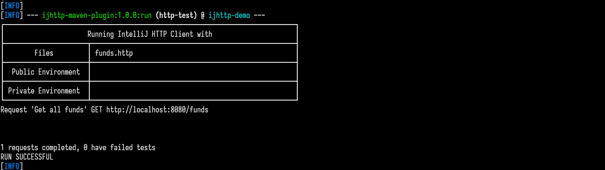

# ijhttp tools: Maven Plugin and Spring Boot Test autoconfiguration

I had started with Maven Plugin to run HTTP requests on the <em>integration-test</em> phase
using the [IntelliJ HTTP Client][http-client]. Later I added Spring Boot Test autoconfiguration,
thanks @GoncaloPT for [his idea][leverage-test].

[](https://app.codacy.com/gl/bot-by/ijhttp-maven-plugin/dashboard?utm_source=gl&utm_medium=referral&utm_content=&utm_campaign=Badge_grade)
[](https://app.codacy.com/gl/bot-by/ijhttp-maven-plugin/dashboard?utm_source=gl&utm_medium=referral&utm_content=&utm_campaign=Badge_coverage)
[](https://www.oracle.com/java/technologies/downloads/#java17)

Table of Contents
=================

   * [Getting started](#getting-started)
   * [Usage](#usage)
      * [Maven Plugin](#maven-plugin)
      * [Spring Boot Test autoconfiguration](#spring-boot-test-autoconfiguration)
   * [Contributing](#contributing)
   * [History](#history)
   * [License](#license)

Created by [gh-md-toc](https://github.com/ekalinin/github-markdown-toc)



## Getting started

Originally the IntelliJ HTTP Client plugin allows to create, edit, and execute HTTP requests
directly in the IntelliJ IDEA code editor.
The IntelliJ HTTP Client is also [available as a CLI tool][cli-tool].

The Maven plugin allows to run HTTP requests on the <em>integration-test</em> phase
using the IntelliJ HTTP Client. The Spring Boot Test autoconfiguration allows to run them with
Spring Boot Test, you don't need to package and run whole application.

The [HTTP Request in Editor Specification][specification]
describes format these files.

Example requests:

```language-apex
GET https://example.com/api/get

### Add an item
POST https://example.com/api/add
Content-Type: application/json

{
  "name": "entity",
  "value": "content"
}
```

## Usage

**Important!** Both plugin and autoconfiguration do not contain the HTTP client: you need
to install it by yourself then add to `PATH`. You can also set the full path to the ijhttp
via the parameter `executable`. The [HTTP Client Demo][demo] has some examples
how to download the HTTP client.

### Maven Plugin

[](https://search.maven.org/artifact/uk.bot-by.ijhttp-tools/ijhttp-maven-plugin)
[](https://javadoc.io/doc/uk.bot-by.ijhttp-tools/ijhttp-maven-plugin)

There is one goal **run**. To use it add the plugin to your POM.

Example of full configuration:

```language-xml
<plugin>
  <groupId>uk.bot-by.ijhttp-tools</groupId>
  <artifactId>ijhttp-maven-plugin</artifactId>
  <version><!-- search on Maven Central --></version>
  <executions>
    <execution>
      <configuration>
       <environmentFile>public-env.json</environmentFile>
       <environmentName>dev</environmentName>
       <files>
         <file>sample-1-queries.http</file>
         <file>sample-2-queries.http</file>
       </files>
       <logLevel>HEADERS</logLevel>
       <report>true</report>
       <workingDirectory>target</workingDirectory>
      </configuration>
      <goals>
        <goal>run</goal>
      </goals>
      <id>simple-run-with-report</id>
    </execution>
  </executions>
</plugin>
```

To manage plugin's output use `useMavenLogger`, `quietLogs` and `outputFile`.

### Spring Boot Test autoconfiguration

You can set configuration in `application.yaml` or manually, or combine both ways.

Example of autoconfiguration, full configuration:

```yaml
ijhttp:
  parameters:
    connect-timeout: 9000
    # docker-mode: false default value
    environment-file: public-env.json
    environment-name: dev
    # executable: ijhttp default value
    files:
      - orders.http
      - products.http
      - checkout.http
    # insecure: false default value
    log-level: verbose
    private-environment-file: private-env.json
    # proxy: http://localhost:3128/
    report: true
    report-path: target/ijhttp
    socket-timeout: 9000
  # timeout: 7000
```

```java
@SpringBootTest(webEnvironment = WebEnvironment.DEFINED_PORT)
@AutoConfigureHttpClientCommandLine(timeout = 7000)
class HttpClientCommandLineApplicationTests {

  @Autowired
  private Executor executor;

  @Autowired
  private HttpClientCommandLine httpClientCommandLine;

  @Test
  void httpClientCommandLine() throws IOException {
    // when
    var exitCode = executor.execute(httpClientCommandLine.getCommandLine());

    // then
    assertEquals(0, exitCode);
  }

}
````

## Contributing

Please read [Contributing](contributing.md).

## History

See [Changelog](changelog.md)

## License

Copyright 2023 Vitalij Berdinskih

Licensed under the Apache License, Version 2.0 (the "License");
you may not use this file except in compliance with the License.
You may obtain a copy of the License at

http://www.apache.org/licenses/LICENSE-2.0

Unless required by applicable law or agreed to in writing, software
distributed under the License is distributed on an "AS IS" BASIS,
WITHOUT WARRANTIES OR CONDITIONS OF ANY KIND, either express or implied.
See the License for the specific language governing permissions and
limitations under the License.

[Apache License v2.0](LICENSE)  
[](http://www.apache.org/licenses/LICENSE-2.0.html)

[http-client]: https://www.jetbrains.com/help/idea/http-client-in-product-code-editor.html

[leverage-test]: https://github.com/bot-by/ijhttp-maven-plugin/issues/51 "Leverage test instead of using main app"

[cli-tool]: https://www.jetbrains.com/help/idea/http-client-cli.html

[specification]: https://github.com/JetBrains/http-request-in-editor-spec

[demo]: https://gitlab.com/vitalijr2/ijhttp-demo
